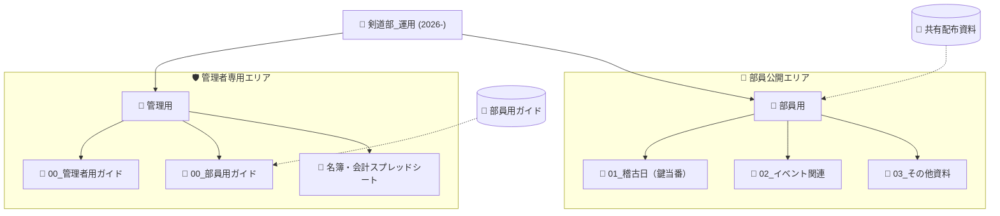

# 豊中修猷館 Webシステム：管理者用・統合リソース

このファイルには、NotebookLMでのマニュアル作成用プロンプトと、その元となるシステム情報をすべてまとめています。**このファイル一本で、NotebookLMによるマニュアル自動修正・生成が完結します。**

---

## 1. NotebookLMへの指示文（プロンプト）

**NotebookLMのチャット欄に、以下の点線内の文章をコピー＆ペーストしてください。**

----------------------------------------------------------------------
**【指示：管理者向け運用マニュアルの作成】**
これから提供する資料に基づき、IT初心者でも迷わずに操作できる「豊中修猷館 Webサイト・システム運用マニュアル（管理者編）」を作成してください。構成には以下の内容を必ず含めてください。

**1. システムの全体構造の解説**
本サイトが以下の「三層構造」になっていることを初心者に分かりやすく説明してください。

- **公開用サイト**：一般の方が閲覧するホームページ。
- **部員用ポータル（青色）**：部員専用。情報の確認・資料DL目的（閲覧専用）。
- **管理者用ポータル（赤色）**：運営責任者用の「司令塔」。情報の追加・編集・削除用。

**2. 管理画面（管理者ポータル）の主要機能**
以下の操作手順を具体的なステップで解説してください。

- **お知らせ投稿**：部員への連絡発信。
- **入会申請の承認**：新規入会希望者の承認フロー。
- **稽古スケジュールの管理**：Googleカレンダー連携と更新方法。
- **資料・ガイドの編集**：Googleドライブと連動したファイル管理。
- **お問い合わせ管理**：外部メッセージの確認。

**3. 執筆のトーン＆マナー**

- 専門用語を避け、日常会話のような言葉を使ってください。
- 箇条書きや太字を多用し、視覚的に分かりやすくしてください。
- 「赤色の画面は管理者モード」といった、間違いを防ぐコツを盛り込んでください。

----------------------------------------------------------------------

---

## 2. システム構成・運用リソース（学習用データ）

**以下の内容をNotebookLMに「ソース」として追加、または内容をコピーして読み込ませてください。**

### 2.1 フォルダ構成の図解（Googleドライブ）

管理・部員の権限はフォルダの場所で厳格に管理されています。

### 2.2 主要機能の操作手順

#### ① 入会申請の承認

1. 管理者ポータルで「新規申込の承認」を押す。
2. 承認すると名簿が更新され、本人に通知メールが届きます。

#### ② お知らせの投稿

1. 「お知らせ投稿」から作成。
2. 「固定表示」にすると、サイトの最上段に残り、重要な連絡を見逃されません。

#### ③ 資料のアップロード（表示ルール）

- **フォルダ**: 名前を `01_` など数字で始めると、部員ポータルに表示されます。
- **ファイル**: 数字がなくても、フォルダ内にあるものはすべて部員に公開されます。

---

## 3. 重要：設定環境変数（技術情報）

| 項目名 | 対象フォルダ | 環境変数名 |
| :--- | :--- | :--- |
| **共有配布資料** | `部員用` | `VITE_DOCUMENTS_FOLDER_ID` |
| **部員用ガイド** | `00_部員用ガイド` | `VITE_FOLDER_ID_MANUAL` |
| **行事関連** | `02_イベント関連` | `VITE_FOLDER_ID_EVENTS` |
| **当番・連絡網** | `01_稽古日（鍵当番）` | `VITE_FOLDER_ID_KEY` |
