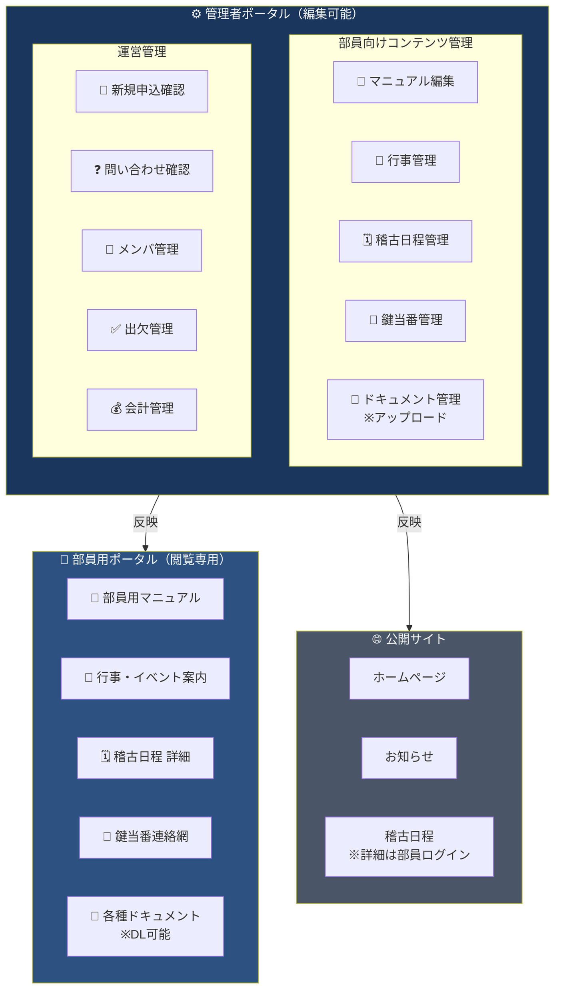
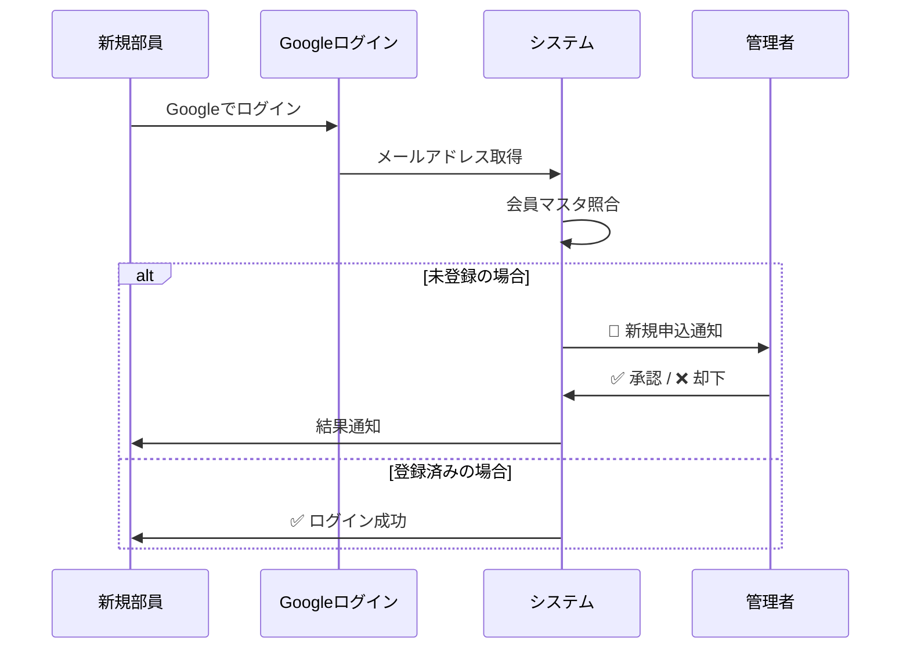
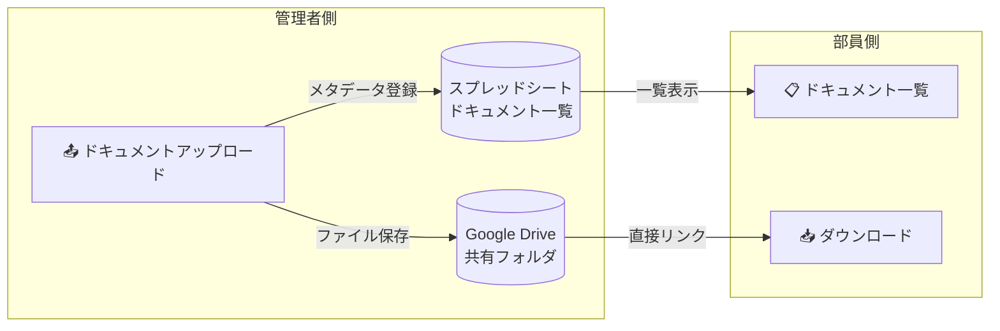

# 修猷館 会員ポータルシステム UX設計提案

## ご提供いただいたイメージ

````carousel

<!-- slide -->

````

---

## システム全体像



---

## 導線設計の核心ポイント

### 1. 権限レベルの明確な分離

| レベル | 対象者 | 権限 | ログイン |
|--------|--------|------|----------|
| **公開** | 誰でも | 閲覧のみ | 不要 |
| **部員** | 承認済み会員 | 閲覧 + DL | Google認証 + 管理者承認 |
| **管理者** | 指定アカウント | 全機能 | Google認証（特定メール） |

### 2. 部員ログインの承認フロー



---

## 管理者画面レイアウト提案（10ボタン）

> [!TIP]
> **2段構成**で視覚的にグループ化し、目的別に迷わず操作できるレイアウト

```
┌─────────────────────────────────────────────────────┐
│                    管理者ダッシュボード                   │
├─────────────────────────────────────────────────────┤
│                                                     │
│  ┌─────────────────────────────────────────────┐   │
│  │     📋 部員向けコンテンツ管理                    │   │
│  ├─────────────────────────────────────────────┤   │
│  │ [📖 マニュアル] [📅 行事管理] [🗓️ 稽古日程]    │   │
│  │ [🔑 鍵当番管理] [📁 ドキュメント管理]           │   │
│  └─────────────────────────────────────────────┘   │
│                         │                          │
│                         ▼                          │
│                   部員ポータルへ反映                  │
│                                                     │
│  ┌─────────────────────────────────────────────┐   │
│  │     ⚙️ 運営管理                              │   │
│  ├─────────────────────────────────────────────┤   │
│  │ [📝 新規申込] [❓ 問い合わせ] [👥 メンバ管理]  │   │
│  │ [✅ 出欠管理] [💰 会計管理]                   │   │
│  └─────────────────────────────────────────────┘   │
│                                                     │
└─────────────────────────────────────────────────────┘
```

### ボタン配置の意図

| グループ | 目的 | ボタン | データの流れ |
|----------|------|--------|--------------|
| **部員向け** | 部員が見るコンテンツを管理 | 5つ | 管理者 → 部員ポータル |
| **運営管理** | 内部運営・会計など | 5つ | 管理者のみで完結 |

---

## Google Drive連携設計

### ドキュメント管理のフロー



### 実装のポイント

| 項目 | 管理者側 | 部員側 |
|------|----------|--------|
| **操作** | アップロード・削除・編集 | 閲覧・ダウンロードのみ |
| **表示** | カテゴリ管理・公開設定 | カテゴリ別閲覧 |
| **ファイル形式** | PDF, Word, Excel対応 | 同左（DL可能） |

---

## 部員ポータル機能詳細

### 5つのメニュー

| メニュー | 内容 | データソース |
|----------|------|--------------|
| 📖 部員用マニュアル | 会の規則、心得、FAQ | Google Docs埋め込み or Markdown |
| 📅 行事・イベント案内 | 大会、懇親会、総会など | Googleカレンダー + お知らせ |
| 🗓️ 稽古日程 | 詳細時間、場所、担当者 | スプレッドシート |
| 🔑 鍵当番連絡網 | 当番表、緊急連絡先 | スプレッドシート |
| 📁 各種ドキュメント | 申請書、規約など | Google Drive |

> [!IMPORTANT]
> **部員ポータルは閲覧専用** - 編集ボタンは非表示、管理者画面からのみ更新可能

---

## 次のステップへの提案

1. **優先度の決定**: どの機能から実装するか
2. **データ構造の設計**: スプレッドシートのシート設計
3. **UIモックアップ**: 実際の画面デザイン作成
4. **段階的実装**:
   - Phase 1: 部員ログイン + 承認フロー
   - Phase 2: ドキュメント管理
   - Phase 3: その他の機能

---

## 確認事項

この設計について以下をお聞かせください：

1. **ボタンの10個構成**で問題ないですか？追加・削除したい機能はありますか？
2. **部員承認フロー**は自動メール通知が必要ですか？
3. **会計管理**はどこまでの機能が必要ですか？（閲覧のみ？入力も？）
4. **スマホ対応**は重要ですか？（モバイルファーストで設計するか）
