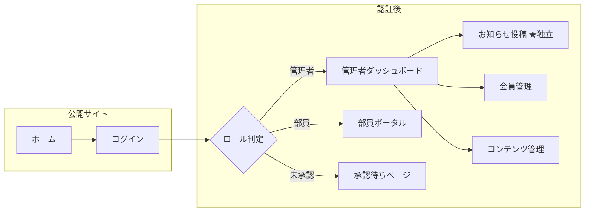

# 修猷館剣道部ポータル UI/UX 改善計画

## 背景・課題

現在のポータルは機能が充実していますが、以下の課題があります：

1. **お知らせ管理の動線**: 「お知らせ管理」がAdminDashboard内のタブに埋もれている
2. **情報の分散**: 管理機能が2つのセクションに分かれており、どこに何があるか分かりにくい
3. **部員用と管理用の差別化**: 両者のUIが類似しており、どちらにいるか視覚的に分かりにくい

---

## 改善方針



---

## 提案する変更

### 🎯 変更1: 管理者メニューの「お知らせ投稿」独立化

> [!IMPORTANT]
> **ユーザー確認事項**: 「お知らせ投稿」を管理者メニューのトップに独立したボタンとして配置してよいですか？

現在は「メンバ管理 > お知らせ管理タブ」に入っていますが、使用頻度の高い機能として独立させます。

#### [MODIFY] [AdminPortal.jsx](file:///c:/Users/kotan/Desktop/shuyukan/shuyukan-react-starter-runnable/shuyukan-react-starter/src/components/AdminPortal.jsx)

**変更内容:**

- メニュー最上部に「クイックアクション」セクションを追加
- 「📢 お知らせ投稿」ボタンを目立つ位置に配置
- 直接お知らせ投稿モーダルを開けるようにする

---

### 🎯 変更2: 管理者メニューをカテゴリ別に整理

現在の2セクション構成を3セクションに再編成し、より直感的に：

| 現在 | 提案 |
|------|------|
| 部員向けコンテンツ管理 | **📢 クイックアクション**（お知らせ投稿） |
| 運営管理 | **📋 部員向けコンテンツ**（マニュアル、行事、日程、鍵当番、ドキュメント） |
| | **⚙️ 運営・会員管理**（新規申込、問合せ、会員、出欠、会計） |

---

### 🎯 変更3: 視覚的なロール識別の強化

#### [MODIFY] [MemberHome.jsx](file:///c:/Users/kotan/Desktop/shuyukan/shuyukan-react-starter-runnable/shuyukan-react-starter/src/pages/MemberHome.jsx)

**変更内容:**

- 管理者用画面には**赤色アクセント**のヘッダーバー
- 部員用画面には**青色アクセント**のヘッダーバー
- 画面左上に常にロールバッジを表示

---

### 🎯 変更4: 部員用ポータルのシンプル化

#### [MODIFY] [MemberPortal.jsx](file:///c:/Users/kotan/Desktop/shuyukan/shuyukan-react-starter-runnable/shuyukan-react-starter/src/components/MemberPortal.jsx)

**変更内容:**

- カード型レイアウトに変更（より視覚的に分かりやすく）
- 各メニューに「最終更新日」または「新着バッジ」を表示
- 稽古日程をデフォルト表示（最も使用頻度が高い）

---

### 🎯 変更5: 部員用画面での編集制限の明確化

部員用画面に「閲覧専用」バッジを追加し、閲覧のみであることを視覚的に明示。

```diff
 <!-- 部員ポータル -->
+<div className="bg-blue-50 border border-blue-200 rounded-lg p-2 text-center text-sm text-blue-700 mb-4">
+    📖 このポータルは閲覧専用です
+</div>
```

---

## 実装の優先順位

| 優先度 | 変更 | 工数目安 |
|--------|------|----------|
| 🔴 高 | お知らせ投稿の独立化 | 30分 |
| 🟡 中 | 管理者メニューの再編成 | 30分 |
| 🟡 中 | 視覚的ロール識別 | 20分 |
| 🟢 低 | 部員ポータルのカード化 | 45分 |
| 🟢 低 | 閲覧専用バッジ追加 | 10分 |

---

## 検証計画

### ブラウザでの手動確認

1. **管理者ログイン**: `kotani.tatsuhiro@gmail.com` でログインし、管理者画面を確認
   - 「お知らせ投稿」が独立して表示されているか
   - メニューが3セクションに分かれているか
   - 赤色アクセントが表示されているか

2. **部員ログイン**: 登録済み部員アカウントでログインし、部員画面を確認
   - 青色アクセントが表示されているか
   - 「閲覧専用」バッジが表示されているか
   - 各メニューが正常に動作するか

3. **未承認ユーザー**: 新規Googleアカウントでログインし、承認待ち画面を確認

### ローカル開発サーバーでの確認

```bash
cd c:\Users\kotan\Desktop\shuyukan\shuyukan-react-starter-runnable\shuyukan-react-starter
npm run dev
```

ブラウザで `http://localhost:5173` を開いてログイン確認。

---

## 将来的な追加提案（今回のスコープ外）

- [ ] 承認通知メール（Apps Script）
- [ ] 出欠管理の専用画面化
- [ ] 会計管理のグラフ表示
- [ ] Instagramフィード連携

---

> [!NOTE]
> この計画は現状分析に基づく提案です。実装前にご確認いただき、優先順位や変更内容について調整可能です。
